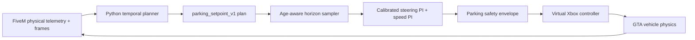

# Parking model-to-game control contract

Status: **Option B implemented; live vehicle calibration and FiveM acceptance remain pending.**

## Decision

The parking runtime now uses `parking_setpoint_v1`. The model describes the physical steering state and speed it wants, and one calibrated feedback controller owns the conversion to virtual Xbox inputs.

This is a hard contract break. Legacy `steering`, `acceleration`, and `brakePressureAvg` checkpoints are rejected with a retraining error; physical acceleration is never reinterpreted as a trigger value.

| Boundary | Previous behavior | Implemented behavior |
|---|---|---|
| Training target | Physical state mixed with actuator-like names | Desired normalized wheel steer, desired speed in m/s, stop probability |
| Horizon | Future rows collapsed or assigned unrelated timing bins | Exact `50, 100, 150, 200, 250, 300 ms`, derived from dataset cadence |
| Longitudinal control | Acceleration reinterpreted as throttle/brake, then held and smoothed | Bounded speed PI produces one signed effort |
| Steering control | Wheel state sent as if it were a thumbstick command | Calibrated feed-forward map plus bounded steering PI feedback |
| Stop | Brake thresholds and low-speed heuristics spread across layers | Probability hysteresis, service brake while moving, handbrake only at confirmed low speed |
| Ownership | Several translation/tuning surfaces | One versioned setpoint plan and one parking controller owner |
| Failure | Legacy fallback/decay could remain involved | Stale or invalid input fails closed inside the parking actuator path |

## Versioned wire contract

```text
parking_setpoint_v1
  sampled_at_s: observation wall-clock timestamp
  received_at_s: assigned by the Go backend
  direction: forward
  points:
    - dt_ms: 50 | 100 | 150 | 200 | 250 | 300
      desired_wheel_steer_normalized: [-1, 1]
      desired_speed_mps:              [0, 2.22]
      stop_probability:               [0, 1]
```

The checkpoint, `/model`, and `/predict` responses all carry planner format version 2 plus the contract name, version, ordered targets, output activations, physical ranges, direction, and horizon timing. The Go bridge checks every field before it builds a plan. `/predict` must echo the exact source-frame `sampled_at_s` sent with the observation. The actuator overwrites `received_at_s` at its own ingress, so plan age cannot be shortened by the model server.

The runtime flow is now:



There is no future-row blending, acceleration-to-trigger adapter, two-second throttle hold, model brake cutoff, legacy temporal horizon, or generic processor on this path.

## Training contract

The new planner heads are bounded deliberately:

- `desired_wheel_steer_normalized`: normalized signed-cap target with a `tanh` model output.
- `desired_speed_mps`: normalized positive-cap target with a `sigmoid` output, denormalized to `0..2.22 m/s`.
- `stop_probability`: binary target with a sigmoid output and logits-based binary cross-entropy.

Each future target is selected by source timestamp at the declared 50 ms cadence, not by whichever row happens to come next. Stop is positive only when the vehicle is parked, or while it is settling inside the bay, aligned, and below the low-speed threshold. Failed, stopping, moving, and malformed states are negative or rejected.

Training defaults to attempts with complete metadata for a successful `parking` / `forward-bay` outcome. Missing metadata, failed attempts, and non-parking trips are excluded. `dataset.include_failed_or_nonparking_trips = true` is an explicit diagnostic opt-in, not the expert-data default.

The checkpoint format is `temporal_telemetry_gru_v2`. It persists the target transforms, 50 ms telemetry sample interval, derived control timing, direction, and full control contract. A v1 actuator-output checkpoint cannot be loaded into this runtime.

## Feedback controller

At each actuator tick:

1. The sampler evaluates the plan at `observation age + estimated actuation latency` and clamps only when that time lies beyond the declared horizon.
2. A monotonic piecewise-linear profile maps desired physical wheel steer to a feed-forward stick command.
3. A bounded steering PI correction compares desired and measured wheel steer. Saturation-aware anti-windup and elapsed-time slew limits are applied in the controller.
4. A bounded speed PI compares desired and measured speed. Its one signed output becomes either throttle or service brake, never both.
5. Stop hysteresis latches at the configured entry probability and releases only below a lower threshold. It requests service braking above hold speed and handbrake below it.
6. The final safety envelope enforces normalized bounds and the parking speed limit before writing the virtual controller.

The trace exposed by `GET /actuator/state` includes the accepted/applied plan IDs, plan age, source and receipt telemetry ages, sampled physical setpoint, measured steering and speed, feed-forward/P/I terms, stop latch, requested effort, final device command, calibration identity, and the last fault.

## Calibration and identity gate

Model inference cannot arm until `[backend.parking_controller]` contains a verified profile. A verified profile records:

- a profile ID;
- the exact FiveM vehicle model hash;
- the game build;
- the controller adapter version;
- the `positive_wheel_is_positive_xinput` steering convention; and
- a monotonic steering map covering normalized wheel steer from `-1` through `+1`.

The current vehicle model hash is the identity field enforced at runtime: it must match before arming and at every actuator tick. The game build and adapter version are required operator-recorded provenance because the current telemetry API does not sense them; confirm them manually whenever enabling a profile. The checked-in profile intentionally remains unverified until a real Windows/FiveM calibration is recorded.

Calibration procedure:

1. Read `vehicleModelHash` from `GET /control/state` while seated in the evaluation vehicle.
2. At walking speed, send small positive and negative manual steering commands and verify that positive physical wheel steer and positive XInput both turn right.
3. Record settled physical wheel steer for several stick commands on each side and replace the identity map with monotonic measured points.
4. Check low trigger response, service braking, coast-down, observation-to-actuation latency, and tick jitter.
5. Record the game/adapter identity, set `calibration_verified = true`, restart the backend, and confirm `parkingController.ready` before loading a model.

Do not mark the profile verified based only on unit tests or an assumed identity curve.

## Removed paths

The hard break removed:

- the unused Go translation service, HTTP endpoints, tuning UI, and config section;
- the unused Python `control_translation.py` module;
- legacy prediction collapse and acceleration/brake reinterpretation;
- throttle-hold and general inference smoothing settings;
- the unrelated hard-coded temporal-horizon actuator and immediate-command adapter; and
- the dead general-purpose actuator processor.

Manual actuator commands remain available for calibration and emergency release, but an armed parking session owns the actuator. Ownership immediately applies a speed-aware stop while the first plan is pending. Parking inference may then submit only versioned setpoint plans or request an actuator-owned terminal stop. That stop persists under parking ownership, uses service brake while moving, and changes to handbrake only after fresh low-speed telemetry. A competing enabled command is rejected; an explicit disabled manual safety command may preempt the session.

## Why Option B, and what comes next

Option A, direct controller imitation, would need real expert stick/trigger recordings. Existing physical-state demonstrations are not honest direct-action labels. Option C, local trajectory output with a tracking controller, remains the better long-term interface for reverse and parallel parking but needs ego-frame path targets and explicit direction/gear supervision.

Option B reuses the forward-bay physical telemetry while fixing the meaning mismatch now. Its speed controller and calibrated gamepad boundary can later sit beneath an Option C trajectory tracker.

Useful external analogues remain CARLA's separation between direct [`VehicleControl`](https://carla.readthedocs.io/en/latest/python_api/#carla.VehicleControl) and physical [`AckermannVehicleControl`](https://carla.readthedocs.io/en/latest/python_api/#carla.AckermannVehicleControl), XInput's explicit stick/trigger ranges ([Microsoft XINPUT_GAMEPAD](https://learn.microsoft.com/en-us/windows/win32/api/xinput/ns-xinput-xinput_gamepad)), and DAgger-style collection of recovery states after the first closed-loop policy ([Ross, Gordon, and Bagnell](https://proceedings.mlr.press/v15/ross11a/ross11a.pdf)).

## Remaining acceptance gates

Repository tests prove the schema, transforms, controller math, ownership, and fail-safe behavior. They do not prove vehicle calibration or live performance. Before treating Option B as operational:

- calibrate and verify one vehicle profile on the actual game/controller stack;
- replay scripted steering, speed, stop, stale-plan, and identity-mismatch cases;
- confirm throttle and brake never overlap in the device trace;
- confirm similar setpoint tracking across supported inference rates;
- run successful and deliberately failed FiveM evaluations with fixed seeds; and
- record success, collision, pose error, completion time, oscillation, and safety-intervention metrics.

Reverse remains prohibited. Enabling reverse or parallel parking requires an explicit supervised direction/gear contract and a separately tested interlock.
