# Parking model-to-game control contract

Status: proposed; implementation choice pending

## Recommendation

Use **Option B: closed-loop steering and speed setpoints** for the next parking model.

The current dataset mostly records vehicle state, not controller input. Option B makes that distinction explicit: the model asks for a physical steering state and a speed, then a small feedback controller converts the request into Xbox stick and trigger values. It reuses most of the current parking data, is easy to observe, and leaves a clean path to the trajectory controller in Option C.

Do not delete the current actuator until the option is selected. The actuator still owns valuable fail-safe behavior. Replace its ambiguous translation stages behind a versioned contract, then remove the dead paths after replay and live parking comparisons pass.

## What is wrong today

The current system does not have one agreed meaning for a model output.

```mermaid
flowchart LR
    A["Future physical vehicle state labels"] --> B["Temporal model outputs"]
    B --> C["Denormalize"]
    C --> D["Blend first three future rows"]
    D --> E["Reinterpret acceleration as throttle or brake"]
    E --> F["Throttle hold"]
    F --> G["Deadzone, per-call rate limit, and smoothing"]
    G --> H["Live gains, brake threshold, and speed safety"]
    H --> I["Xbox stick and triggers"]
    I --> J["GTA vehicle physics"]
```



### 1. Training labels and runtime commands describe different things

The FiveM collector records physical state: normalized wheel angle, GTA's current acceleration, and average wheel brake pressure ([`egoService.ts`](../fivem/src/egoService.ts#L1152-L1196)). The dataset then uses those future values as `steering`, `acceleration`, and `brakePressureAvg` targets ([`dataset.py`](../fsd_trainer/src/gta_fsd/dataset.py#L234-L241)).

At runtime, `collapsePlannerCommand` treats those values as controller actions: predicted acceleration becomes throttle when positive and brake when negative, while predicted brake pressure becomes another brake demand ([`inference.go`](../backend/internal/capture/inference.go#L2041-L2097)). A future physical acceleration of `0.3` is not the same quantity as a right-trigger command of `0.3`; GTA's drivetrain, gear, grade, drag, speed, and frame timing sit between them.

The wheel-state target has the same category error. A normalized physical wheel angle is currently sent as a normalized thumbstick position even though GTA can apply its own response curve and rate behavior.

### 2. Several nonlinear translators are stacked

The active path blends three future predictions, maintains throttle through a hold window, then applies clamping, deadzones, per-call rate limits, and exponential smoothing ([`inference.go`](../backend/internal/capture/inference.go#L1821-L1864), [`processor.go`](../backend/internal/actuator/processor.go#L97-L153)). The actuator then applies another set of gains and safety thresholds before writing the virtual controller.

The configured `model_brake_threshold` is `0.55`, so a model brake result at or below that value is discarded ([`train_config.toml`](../fsd_trainer/train_config.toml#L7-L18)). This makes learned low brake pressure invisible. The rate limits are deltas per inference call rather than units per second, so their physical behavior changes if inference frequency or latency changes.

Finally, the Windows adapter sends the remaining values directly to the left stick and triggers ([`controller_windows.go`](../backend/internal/actuator/controller_windows.go#L52-L63)). XInput itself defines a signed thumbstick and unsigned triggers, but the game-specific response is not guaranteed to be linear. Microsoft explicitly notes that game mappings vary and that applications may apply deadzones and nonlinear transforms ([XINPUT_GAMEPAD](https://learn.microsoft.com/en-us/windows/win32/api/xinput/ns-xinput-xinput_gamepad), [XInput dead-zone guidance](https://learn.microsoft.com/en-us/windows/win32/xinput/getting-started-with-xinput#dead-zone)).

### 3. There are multiple tuning surfaces, but only one is on the inference path

The Go translation service is created and exposed through HTTP tuning endpoints, but inference submits directly to the actuator instead of calling `translationService.Submit` ([`main.go`](../backend/cmd/main.go#L76-L77), [`main.go`](../backend/cmd/main.go#L352-L409), [`inference.go`](../backend/internal/capture/inference.go#L1722-L1729)). Its UI can therefore appear tunable without changing model inference.

The trainer also contains a separate `control_translation.py`; production trainer or backend code does not import it. Several translation-like inference settings are loaded but not used by the active control calculation. Together, `backend.translation`, `backend.inference`, and `backend.actuator` present overlapping ideas without a single owner.

### 4. The temporal contract is not tied to dataset time

The model checkpoint carries future sample offsets, currently `[1, 2, 3, 4, 5, 6]`, but the temporal actuator assigns hard-coded bins of `[100, 200, 350, 500, 750, 1000, 1500]` milliseconds ([`train_config.toml`](../fsd_trainer/train_config.toml#L79-L94), [`temporal.go`](../backend/internal/actuator/temporal.go#L112-L152)). Those bins are not derived from the captured sample timestamps or checkpoint cadence.

The temporal path also supports local trajectory points, but the active model does not output local `x/y` points. That means its nominal lateral tracker often has only a future heading or steering value rather than a geometric path. Keeping this mode disabled for the parking reset is correct until the contract is fixed.

### 5. Model selection is open-loop, not parking-aware

`drive_score` combines validation control loss, validation control MAE, and a train/validation gap ([`train.py`](../fsd_trainer/src/gta_fsd/train.py#L1742-L1763)). It does not measure whether a closed-loop attempt finishes inside the bay, its final pose error, collisions, oscillation, or intervention rate. A checkpoint can improve the offline score while becoming worse after its errors feed back into later observations.

## Option A: direct controller imitation

### Contract

Train the model on the exact controls that will be replayed:

```text
parking_direct_v1
  steer_command:             [-1, 1], tanh head
  longitudinal_command:      [-1, 1], tanh head
  hold_probability:          [0, 1], sigmoid head
  direction:                 forward (constant for the current scope)
```

Positive longitudinal output maps to the right trigger; negative output maps to the left trigger. A single signed value prevents simultaneous throttle and service brake by construction. The runtime path becomes: validate contract, apply parking safety envelope, map to XInput, update gamepad. The `vgamepad-go` float API already accepts triggers in `[0, 1]` and sticks in `[-1, 1]` ([project documentation](https://github.com/CB2Moon/vgamepad-go#xbox360-gamepad)). CARLA uses the same explicit direct-action distinction for throttle, steer, and brake ([CARLA VehicleControl](https://carla.readthedocs.io/en/latest/python_api/#carla.VehicleControl)).

### Training data

This option requires actual expert controller commands. Record human gamepad inputs or commands from an expert controller that this project owns. Do not label direct action from `GetVehicleCurrentAcceleration`, physical wheel angle, or wheel brake pressure.

The current GTA native parking expert may move the vehicle without producing player control-axis values. Before using it for this option, prove with a capture that the recorded input values follow the native driver's actions. If that cannot be proved, native demonstrations are suitable for state or trajectory targets, not direct-action labels.

Use Smooth L1 for the two continuous commands, binary cross-entropy for hold, a temporal action-change penalty, and a small penalty for commands that oppose the demonstrated stop state. Train with measured end-to-end latency jitter so the action corresponds to the observation that will actually reach the game.

### Trade-off

- Best: simplest runtime and the fewest translation layers.
- Cost: requires recollection and is tightly coupled to GTA's controller response, vehicle, and frame timing.
- Risk: ordinary behavior cloning sees mostly expert states. Recovery data is necessary because small errors move the learned policy into states absent from the demonstrations. DAgger addresses this by labeling states visited by the learned policy and aggregating them into later training rounds ([Ross, Gordon, and Bagnell](https://proceedings.mlr.press/v15/ross11a/ross11a.pdf)).

This is viable if the goal is one fixed GTA vehicle and controller configuration and collecting human/controller demonstrations is acceptable.

## Option B: closed-loop steering and speed setpoints (recommended)

### Contract

Have the model describe the vehicle state it wants; have one controller own the conversion to game input:

```text
parking_setpoint_v1
  sampled_at_s
  points[]
    dt_ms
    desired_wheel_steer_normalized: [-1, 1], tanh head
    desired_speed_mps:              [0, 2.22], bounded sigmoid head
    stop_probability:               [0, 1], sigmoid head
  direction: forward
```

`dt_ms` must come from real capture timestamps or a checkpoint-declared cadence, not a backend lookup table. Each name includes its physical meaning and units. A checkpoint with another schema is rejected before arming the controller.

This kind of distinction is standard in simulator APIs: CARLA separates direct `VehicleControl` actions from `AckermannVehicleControl` requests such as desired steering angle, speed, acceleration, and jerk ([CARLA Python API](https://carla.readthedocs.io/en/latest/python_api/#carla.AckermannVehicleControl)).

### Runtime controller

Use two small feedback loops at a fixed actuator tick:

1. The steering servo compares desired normalized wheel angle with measured normalized wheel angle. A calibrated feed-forward lookup supplies most of the stick command; a bounded PI correction removes residual error.
2. The speed servo compares desired speed with current speed. A bounded PI controller with anti-windup produces one signed longitudinal effort. Positive effort becomes throttle and negative effort becomes brake.
3. An explicit stop state overrides the speed servo. It transitions from service brake to handbrake only after speed is below the parking hold threshold.
4. Rate limits use actual elapsed seconds. The safety envelope remains the final owner of freshness, arming, the 8 km/h cap, target identity, hazards, and neutral-on-timeout behavior.

There is no generic two-second throttle hold, hidden brake cutoff, or second general-purpose smoother. If smoothing is needed, it belongs to the feedback controller and is expressed in physical units per second.

### Calibration

Before model evaluation, add a controller calibration run for the chosen vehicle:

- Verify the steering sign with small left and right commands.
- Sweep static stick commands at parking speed and record settled normalized wheel angle.
- Sweep low trigger values and record speed, acceleration, and coast-down response.
- Measure observation-to-game response latency and tick jitter.
- Save the calibration with vehicle model, game build, and controller adapter version.

Use a monotonic piecewise-linear lookup first. A more complex model is justified only if residual plots show a stable nonlinear or speed-dependent response.

### Training data and loss

Most existing captures remain useful:

- `Steering` already supplies desired future wheel steer.
- `future_speed` already supplies desired future speed.
- `stop_probability` can be labeled from settled speed plus the existing parking outcome/pose conditions.
- Physical acceleration remains an input feature if useful, but is removed from the control target set.
- Brake pressure remains telemetry and a stop-label aid, but is not treated as a trigger command.

Use Smooth L1 for steer and speed, binary cross-entropy for stop, stronger near-term weights for servo responsiveness, an endpoint parking-pose loss, and light temporal smoothness penalties. Sample timestamps must define the horizon. Add low-speed perturbation and recovery runs after the first usable policy, following the data-aggregation principle from DAgger.

### Trade-off

- Best: reuses current data, cleanly separates learned intent from vehicle physics, and exposes errors in physical units.
- Cost: requires calibration and controller gains per vehicle family.
- Risk: a poor feedback controller can still oscillate, so it must be tested independently with scripted setpoints before connecting a model.

This is the best next step for forward-bay parking.

## Option C: local trajectory plus a tracking controller

### Contract

Have the model output an ego-frame parking path:

```text
parking_trajectory_v1
  sampled_at_s
  points[]
    dt_ms
    lateral_m
    longitudinal_m
    heading_error_rad
    desired_speed_mps
  stop_probability
  direction: forward
  confidence
```

Use explicit `lateral` and `longitudinal` names instead of ambiguous `x/y`. Train position in meters, heading with wrapped-angle or sine/cosine loss, speed as a bounded nonnegative value, and stop with binary cross-entropy. Add endpoint pose, curvature, curvature-rate, collision, and out-of-bay penalties.

### Runtime controller

Track the local path with a low-speed kinematic bicycle controller. Start with pure pursuit or Stanley for lateral motion and the Option B speed servo. Move to constrained MPC if steering-rate, acceleration, collision, or bay-boundary constraints justify it. Parking MPC literature uses the same separation: planned trajectory plus vehicle-state feedback with a kinematic bicycle model at low speed ([Ignéczi, Horváth, and Pup](https://arxiv.org/abs/2109.10075)).

Trajectory output is easier to draw over the camera and diagnose than raw controls. It is also less coupled to one virtual gamepad. Prior end-to-end driving work has successfully combined learned trajectories with downstream control, and TCP shows a useful hybrid of trajectory and direct-control branches ([Learning by Cheating](https://arxiv.org/abs/1912.12294), [TCP](https://proceedings.neurips.cc/paper_files/paper/2022/hash/286a371d8a0a559281f682f8fbf89834-Abstract-Conference.html)).

### Trade-off

- Best: strongest long-term interface, visual debugging, explicit timing, and future reverse/parallel extension.
- Cost: requires local-pose target generation and more controller engineering.
- Risk: trajectory quality and tracking quality can fail separately; both need their own metrics.

This is the best long-term design, but it is a larger first step than Option B.

## Comparison

| Choice | Existing data reuse | Runtime complexity | GTA/controller coupling | Debuggability | Recommended use |
|---|---:|---:|---:|---:|---|
| A. Direct controller imitation | Low | Low | High | Medium | Fixed vehicle with real command demonstrations |
| B. Steering + speed setpoints | High | Medium | Medium | High | Next forward-parking iteration |
| C. Local trajectory + tracker/MPC | Medium | High | Low | Highest | Long-term reverse and parallel parking |

Option B can evolve into C without discarding its calibrated gamepad adapter or speed controller. A later hybrid checkpoint can keep a shadow direct-action head for diagnosis or consistency training, as TCP does with trajectory and control branches, while trajectory/setpoints remain the only commands allowed to actuate.

## Proposed implementation after selection

### Phase 0: make translation observable

- Add one versioned model-output schema and reject incompatible checkpoints before arming.
- Trace one timestamped row per tick: model plan, sampled setpoint, measured state, controller error, requested Xbox values, applied Xbox values, and resulting vehicle state.
- Add the calibration routine and save its result as a versioned vehicle profile.
- Replay recorded predictions through the controller without connecting ViGEm.

### Phase 1: replace, then remove

- Implement the selected translator behind a `ParkingController` interface.
- Run it in shadow mode beside the current path on recorded data.
- Switch the live parking path only after scripted setpoint tests and replay comparisons pass.
- Remove the unused Go translation service, its tuning UI/config, the unused Python translation module, unused inference tuning fields, the legacy future-row collapse, and the throttle-hold/general smoothing stack.
- Keep actuator ownership, arming acknowledgment, telemetry freshness, target binding, hazard checks, speed cap, neutral timeout, and handbrake hold behavior.

### Phase 2: train for closed-loop parking

- Rank checkpoints first by closed-loop parking results, using offline losses as diagnostics rather than the final selection metric.
- Add recovery attempts from policy-visited offsets and heading errors.
- Expand direction from the current `forward` constant to an explicit supervised state before reverse parking is enabled.
- Adopt local trajectory targets when reverse/parallel scope makes Option C worthwhile.

## Acceptance gates

The replacement is ready only when all of these are recorded:

- Contract mismatch and stale predictions fail closed before controller output.
- Steering calibration confirms sign, monotonicity, saturation, and center behavior.
- Throttle and service brake are never active together.
- The same scripted setpoint produces materially equivalent behavior across supported inference rates because rate limits use elapsed time.
- Trace timestamps account for observation age, inference latency, queue delay, and controller tick time.
- Scripted controllers track steering and speed setpoints without sustained oscillation before any model is connected.
- Closed-loop evaluation reports parking success, collision rate, final lateral/longitudinal/heading error, completion time, steering oscillation, and safety interventions across fixed scenario seeds.
- Live FiveM, ViGEm, and OBS capture are tested; replay/unit tests alone do not satisfy the gate.

## Decision

Pick one:

- **A** for the thinnest runtime and a fresh direct-command dataset.
- **B** for the fastest coherent rebuild using the current parking data. **Recommended.**
- **C** for the strongest long-term parking architecture and a larger initial implementation.

No matter which option is selected, the central rule is the same: every model output must have one name, unit, time, and owner, and it must not change meaning between collection, training, inference, control, and the game.
